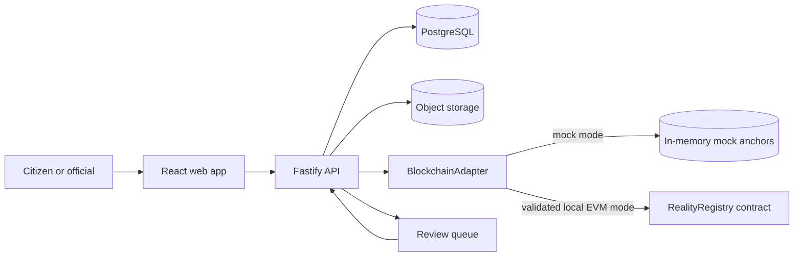

# Architecture

## Trust boundary

RealityFork does not put photographs or personal data on-chain. The browser uploads an evidence file to object storage, receives a content address, and sends only the evidence metadata to the API. The API validates the request, calculates hashes and scores, stores searchable data in PostgreSQL, and anchors the commit hash plus lineage on an EVM network.

## Blockchain adapter boundary

`apps/api/src/blockchain` defines one interface with mock and EVM implementations. Mock mode is the default for tests and the unsigned hackathon demo; it never opens an RPC connection and labels every response `mock: true`. EVM mode loads the generated local deployment manifest and stable ABI, validates chain/address/domain consistency, rejects non-loopback RPC hosts, and requires the manifest relayer/reviewer accounts to be unlocked by local Hardhat.

Local EVM mode uses JSON-RPC unlocked accounts and neither reads nor logs `PRIVATE_KEY`. Support for an explicitly configured production signer is planned and must use a dedicated secret-management design rather than silently reusing the claimant or deployment key.

Signed root, fork, challenge and reviewed-merge routes submit through the adapter after the off-chain record is created. The API stores a lifecycle snapshot (`not_requested`, `pending`, `confirmed` or `failed`) with transaction, chain, contract, timing, block and machine-readable error data. A submission failure never erases the off-chain record. Explicit GET/POST anchor routes expose state and retry pending or failed work; confirmed work is not submitted again.

Reviewed merges have a stricter boundary: both parent records remain unchanged while the merge transaction is pending or failed. Only a confirmed mock transaction, or a confirmed EVM transaction that passes read-back verification, marks the merge `merged` and both parents `superseded`. Confirmed EVM writes are reconciled against the stored commit; any mismatch is stored as `failed` with `ANCHOR_VERIFICATION_MISMATCH`.

Unsigned demo writes require both `ALLOW_UNSIGNED_DEMO_MODE=true` and the mock adapter. EVM mode rejects unsigned root, fork, challenge and merge-shaped writes.

Transactions exposed through the adapter are tracked as `pending`, `confirmed` or `failed`. A receipt timeout remains pending, reverted receipts fail, and simultaneous submissions share one in-memory operation keyed by commit or challenge hash. Failed operations may be resubmitted; pending and confirmed operations remain idempotent. This state disappears on restart and is not a production queue. Confirmations also do not implement reorg handling.

Anchor verification can return `verified`, `not_found`, `mismatch`, `pending` or `network_unavailable`. `verified` means only that the stored hash, evidence root, parent pair, author, status, chain and contract match the registry. It does not establish that the underlying civic claim is true.

## On-chain data

- Commit hash
- Evidence Merkle root or aggregate hash
- Up to two parent commit hashes
- Signer address
- Timestamp and status
- Challenge and merge events

## Off-chain data

- Original media and documents
- Approximate or precise location, according to consent
- Claim text and searchable metadata
- AI-forensics output and reviewer notes
- Source reputation history

## Why this split

The chain provides a shared, append-only ordering and prevents silent history edits. Off-chain storage keeps large files affordable and allows privacy controls, moderation, redaction, and lawful removal. A deleted file leaves a hash behind, so reviewers can still tell that the evidence changed or disappeared.
