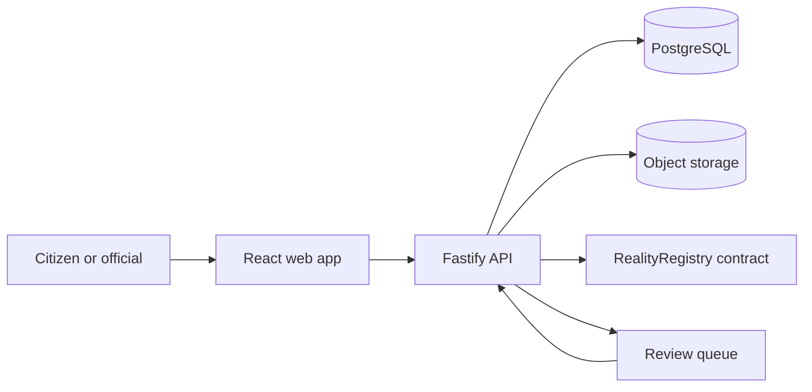

# Architecture

## Trust boundary

RealityFork does not put photographs or personal data on-chain. The browser uploads an evidence file to object storage, receives a content address, and sends only the evidence metadata to the API. The API validates the request, calculates hashes and scores, stores searchable data in PostgreSQL, and anchors the commit hash plus lineage on an EVM network.

## On-chain data

- Commit hash
- Evidence Merkle root or aggregate hash
- Up to two parent commit hashes
- Signer address
- Timestamp and status
- Challenge and merge events

## Off-chain data

- Original media and documents
- Approximate or precise location, according to consent
- Claim text and searchable metadata
- AI-forensics output and reviewer notes
- Source reputation history

## Why this split

The chain provides a shared, append-only ordering and prevents silent history edits. Off-chain storage keeps large files affordable and allows privacy controls, moderation, redaction, and lawful removal. A deleted file leaves a hash behind, so reviewers can still tell that the evidence changed or disappeared.

